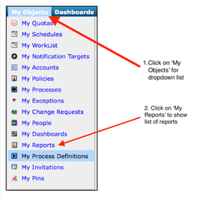

Build a HTML Report using ITC Process Viewer
============================================

This guide will take you through the process of creating a report using
the ITC Process Viewer (the report needs to be in a Process in order for
it tone scheduled). The Process can then be scheduled to run in a time
slot as defined in the ITC Scheduler. When the scheduled run is
completed, the report will be send to the receivers as configured during
the report creation.  

Step-by-step guide
------------------

If you don\'t have an existing Process defined for use or require a new
Process, follow steps 1-3 to create a Process before continuing.  The
Process is required by the ITC Scheduler.

### 1 Start with My Objects

1.1 Select \'My Objects\' from the Dashboard header menu.

{width="2.676388888888889in"
height="2.595138888888889in"}

### 2 Create Process Definition

2.1 Select \'Create New Object\' icon to start the new Process
definition.

{width="4.872916666666667in"
height="1.7513888888888889in"}

### 3 Input Process Definition Details

3.1 The \'Create New Object\' icon will display Process Definition
screen for input.  Click on the \'General\' tab as shown below.

{width="4.872916666666667in"
height="1.925in"}

{width="4.872916666666667in"
height="3.4569444444444444in"}

3.2 Enter the following inputs:

> 3.2.1 Name - this is the name of the Process. This field is
> mandatory.\\
>
> 3.2.2 Description - Process description, can be the same as the
> Process name.
>
> 3.2.3 Tenant - use the dropdown to select the Tenant where the Process
> will be created.
>
> 3.2.4 Owner - use the dropdown to select the owner, usually the
> nominated end-user (Customer). Ask the Tenant administrator, if
> unsure. (Note: if a different owner is used, then you will need to
> impersonate the owner to be able to retrieve and modify the Process
> subsequently).
>
> 3.2.5 Engine - use the dropdown to select the appropriate Engine to
> assign. Ask the Tenant administrator, if unsure.

3.3 Save the inputs

> 3.3.1 After completed the inputs above, select the \'Create new
> Process Definition\' icon, on the top right corner of the screen. This
> will save the inputs and creates the Process Definition as named.

### 4 Display Process Definitions

4.1 The newly created Process Definition is now displayed on the screen.

{width="3.127083333333333in"
height="3.936111111111111in"}

4.2 Use the Process Viewer to maintain the process in the Process
Definition.\\

> 4.2.1 Click on the \'Process Definition\' icon next to the process
> name. A dropdown list of actions will be displayed.
>
> 4.2.2 Select the \'Process Viewer\' option to launch the action.

{width="3.127083333333333in"
height="4.456944444444445in"}

### 5 Navigate the Process Viewer

5.1 When the Process Viewer is displayed, all existing Process
Definitions for the user will be listed otherwise a \<blank\> screen
will be displayed.

{width="3.127083333333333in"
height="4.075in"}

5.2 Click on the \'Graphical Process Composer\' icon to start the create
process. 

{width="3.127083333333333in"
height="4.075in"}

5.3 Expand the Activity node when the tree structure is displayed.

{width="3.127083333333333in"
height="4.196527777777778in"}

5.4 Expand the VirtualAcvtivity node.

> 5.4.1 Look for the Report option within this node.
>
> 5.4.2 Click on this option and drag it into the space on the right of
> the double-line to create the report.

{width="3.127083333333333in"
height="3.936111111111111in"}

### 6 Create Report Template

6.1 After dragging the Report option, the Create Report template is
displayed.

{width="4.872916666666667in"
height="2.3986111111111112in"}

6.2 Enter inputs as follows.

> 6.2.1 Name - 
>
> 6.2.2 Description - 
>
> 6.2.3 Output Type -

{width="4.872916666666667in"
height="2.4680555555555554in"}

6.3 Enter the metrics in the graph or charts format as required in the
report template in HTML format.

> 6.3.1 Sample report template in HTML - the following sample code
> display the SAP System Availability. Replace the following
> (highlighted in RED) with the appropriate values from the tenant where
> the report is being created.
>
> 6.3.1.1 \<h1\> : replace with the required report heading
>
> 6.3.1.2 href= : replace OBJECT\_Id and itconductor.context values with
> the corresponding tenant\'s Availability chart object\_id and context
> values
>
> 6.3.1.3 title : replace with the required report title
>
> 6.3.1.4 OBJECT\_Id : same as 6.3.1.2
>
> 6.3.1.5 context : same as 6.3.1.2
>
> Sample HTML code:
>
> \<itc:report xmlns:itc=\"urn:itconductor\"\>\
> \<h1\>??? Service Health and Utilization Report\</h1\>\
> \<h2 style=\"white-space: nowrap;\"\>\<a
> href=\"[https://service.itconductor.com/thresholdView?OBJECT\_Id=6285545522902332&amp;itconductor.context=6285545521423708](https://service.itconductor.com/thresholdView?OBJECT_Id=6285545522902332&itconductor.context=6285545521423708)\"
> style=\"white-space: nowrap; text-decoration: none;\" title=\"SAP
> System GCP\"\>/T-Systems\_ZuelligPharma/Production/SAP
> Systems/GCP\</a\>\</h2\>
>
> \<!\-- Availability \--\>\
> \<itc:chart\>\
> \<itc:parameter
> name=\"OBJECT\_Id\"\>6285545522902332\</itc:parameter\>\
> \<itc:parameter name=\"context\"\>6285545521423708\</itc:parameter\>\
> \<itc:parameter name=\"title\"\>true\</itc:parameter\>\
> \<itc:parameter name=\"timeScale\"\>HOUR\</itc:parameter\>\
> \<itc:parameter name=\"range\"\>H12\</itc:parameter\>\
> \<itc:parameter name=\"fit\"\>width\</itc:parameter\>\
> \</itc:chart\>
>
> \</itc:report\>

{width="4.872916666666667in"
height="2.6243055555555554in"}

6.4 When all the required inputs are completed, select the \'Create
Report\' icon on the top left screen.

> 6.4.1 A message confirming the successful creation of the report
> object will be displayed.

{width="4.872916666666667in"
height="2.4916666666666667in"}

### 7 Process showing defined Report

The created report will be shown in the Graphical Process Composer in
purple. Double-click on the purple rectangle to confirm, if required,
and it will display the Report definition in Modify mode.

{width="3.127083333333333in"
height="3.439583333333333in"}

### 8 Display My Reports List

8.1 Navigate back to \'My Objects\' on the top menu bar and select \'My
Reports from the dropdown list. 

{width="3.127083333333333in"
height="3.029166666666667in"}

8.2 A list of all the reports associated with the login user will be
displayed. 

> 8.2.1 A hierarchy icon denotes that the Report is defined in a Process
> and can only be run by the ITC Scheduler.
>
> 8.2.2 

{width="4.872916666666667in"
height="0.6590277777777778in"}
